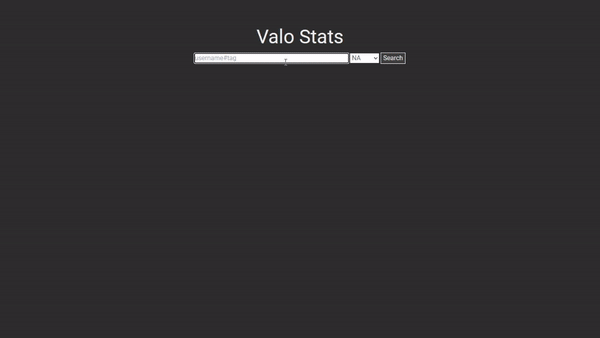
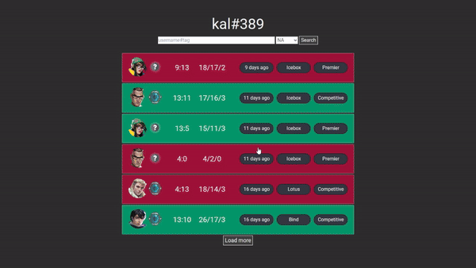
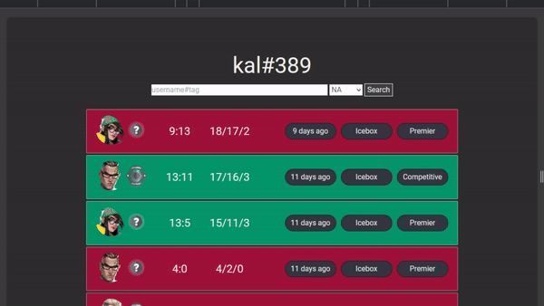
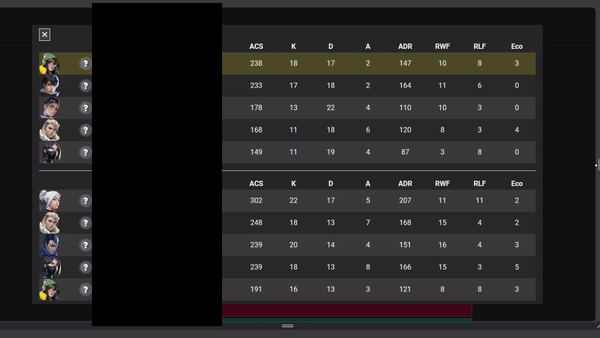
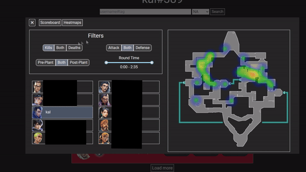

# ValoStatsReact

Port and more complete/extended version of my ValoStats app to Typescript using Express/React using [HenrikDev Unofficial Valorant API](https://github.com/Henrik-3/unofficial-valorant-api).

App made for fun to view Valorant statistics, extensible to view any statistic that can be calculated using the data provided by the Valorant API.

#### Features:

- Scoreboard with calculated statistics not viewable on common stat websites (eg. Round won Frags, Round lost frags, Eco frags)
- Heatmaps to see where a player frequently is during kills/deaths during a game

Only tested running in dev mode, little to no error handling exists. Deathmatch and other gamemodes probably dont work either

## Tech

Client:

- React
  - [react-tooltip](https://www.npmjs.com/package/react-tooltip)
  - [Tanstack react-table](https://www.npmjs.com/package/@tanstack/react-table)
  - [rc-slider](https://www.npmjs.com/package/rc-slider)
- Vite
- Tailwind
- [heatmap-ts](https://www.npmjs.com/package/heatmap-ts) which is a typescript translation of [heatmapjs](https://www.npmjs.com/package/heatmapjs)

Server:

- Express

Python scripts used for lazy method of updating data from [valorant-api.com](https://valorant-api.com/)

## Usage

1. Clone the repository

   ```
   git clone https://github.com/kelvin389/ValoStatsReact
   cd ValoStatsReact
   ```

1. Obtain api key ([HenrikDev Unofficial Valorant API](https://github.com/Henrik-3/unofficial-valorant-api) for more details)
1. Enter root directory. create `.env` file with contents
   ```
   API_KEY=your-api-key-here
   PORT=some-port              (optional)
   ```
1. Install dependencies for client and server:

   ```
   npm run install-all
   ```

1. (Optional) Update assets:

   Assets are already included in the repo but in the future if new ranks, agents, or maps are released then they can be updated here. App is not guaranteed to work in the future even if assets are able to be updated. The script to update assets directly from [valorant-api.com](https://valorant-api.com/) is located at `/app/src/assets/update_assets.py`. To use:

   1. Navigate to directory
      ```
      cd app/src/assets
      ```
   1. Install dependencies
      ```
      pip install -r requirements.txt
      ```
   1. Run the script with args to choose what to update
      ```
      python update_assets.py [arg(s)]
      ```
      Valid args:
      - all
      - maps
      - agents
      - ranks
   1. Return to root directory
      ```
      cd ../../..
      ```

1. Run app and server:

   ```
   npm run dev
   ```

   alternatively, execute `npm run client` or `npm run server` to only run a specific component of the project

by default, the app is hosted at http://localhost:5173 and the api is hosted at http://localhost:5000/api/...

## Demo

Other peoples names censored for privacy

### Main search:



### Overlay Table and sorting



### Responsive Design




### Heatmaps and filtering


